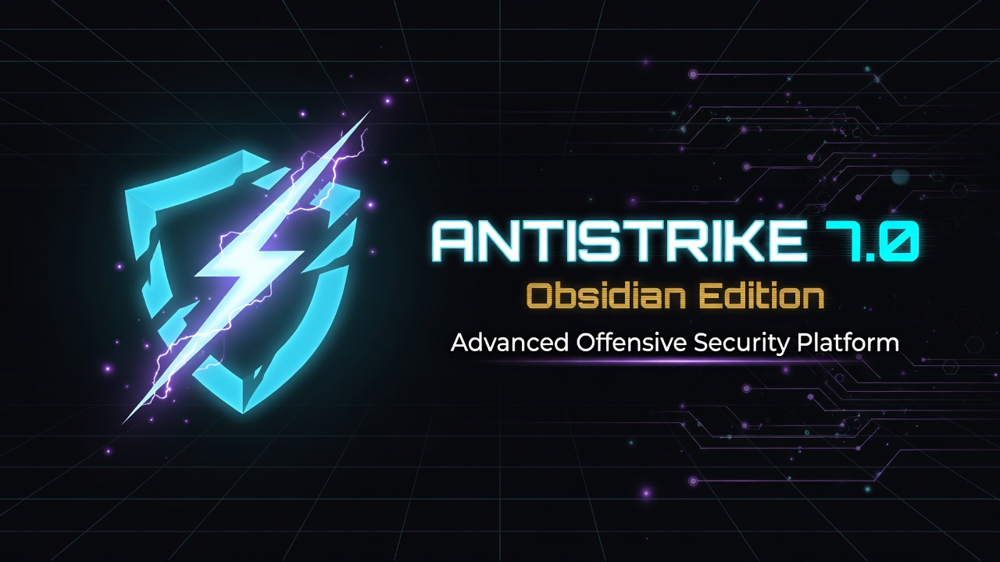
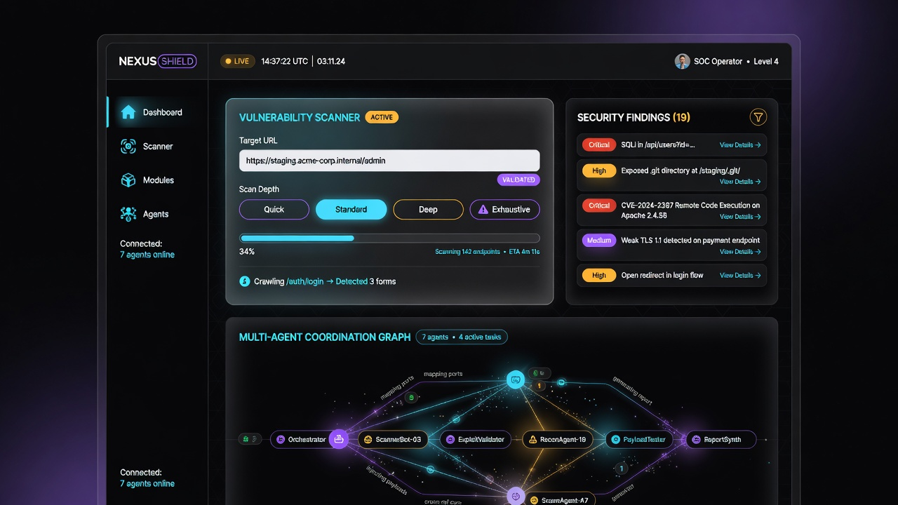
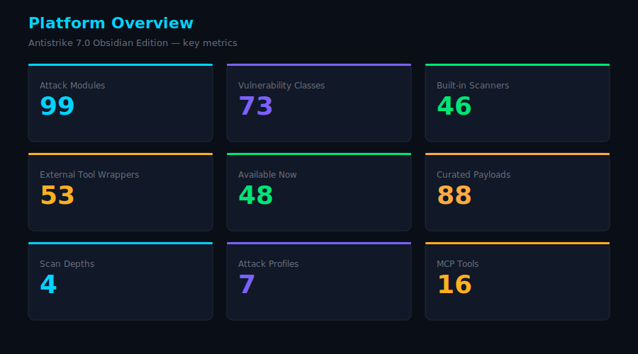
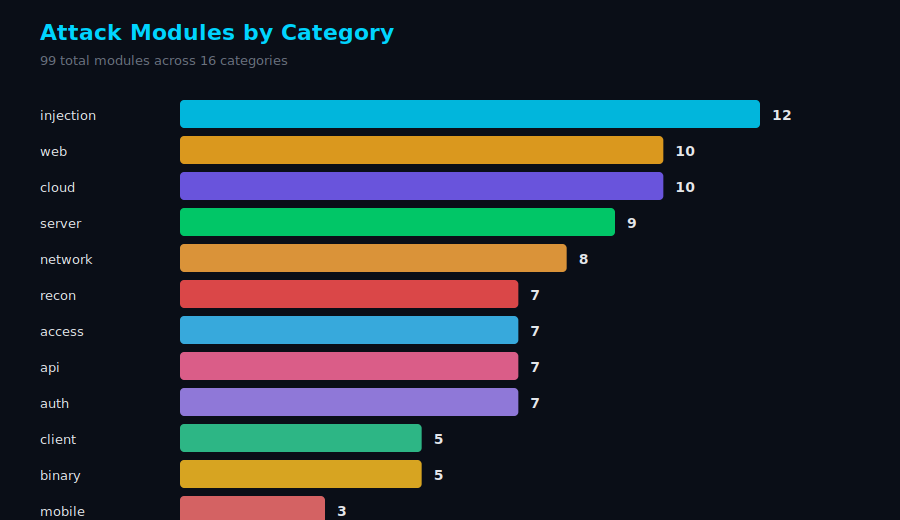
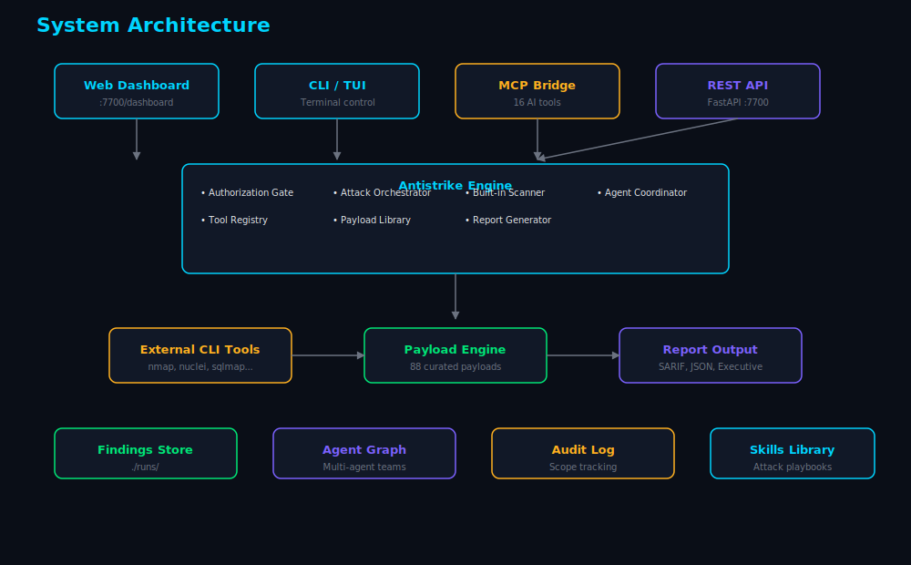

<p align="center">
  
</p>

<p align="center">
  
  <br>
  <strong>Antistrike 7.0 — Obsidian Edition</strong><br>
  Advanced AI-powered penetration testing platform
</p>

# Antistrike 7.0 — Obsidian Edition

Advanced AI-powered penetration testing platform with multi-interface control, expanded attack coverage, and intelligent orchestration.

## Features

- **99 attack modules** — Web, API, network, cloud, mobile, binary, wireless, and more
- **73 vulnerability classes** — SQLi, XSS, SSRF, XXE, SSTI, IDOR, GraphQL, LLM injection, and beyond
- **88 curated payloads** — Organized by attack type with metadata
- **Built-in HTTP scanner** — No external tools required for core testing
- **Multi-agent coordination** — Parallel specialist agents for complex assessments
- **Attack chaining** — Automatic vulnerability chain discovery
- **Three interfaces** — Web dashboard, CLI, and interactive TUI
- **MCP integration** — 16 tools for AI assistant control (Cursor, Claude, Copilot)
- **Authorization gate** — Mandatory scope registration before any testing
- **Reporting** — Executive summary, SARIF, and JSON export

## Quick Start

```bash
# Install
cd Antistrike-7.0
pip install -e .

# Start the API server
antistrike-server
# or: python -m antistrike.cli.main serve

# Open the web dashboard
# http://127.0.0.1:7700/dashboard

# Register authorization (required before scanning)
antistrike authorize https://target.example.com -a "Security Lead"

# Run a scan
antistrike scan https://target.example.com --depth standard

# Full profile assessment
antistrike assess https://target.example.com --profile web --depth deep

# Interactive TUI
antistrike tui

# List available modules
antistrike modules
```

## MCP Setup

Add to your AI assistant MCP config:

```json
{
  "mcpServers": {
    "antistrike": {
      "command": "python3",
      "args": ["-m", "antistrike.mcp.bridge", "--server", "http://127.0.0.1:7700"],
      "timeout": 600
    }
  }
}
```

Or copy `config/antistrike-mcp.json` into your client configuration.

### MCP Tools

| Tool | Description |
|------|-------------|
| `register_scope` | Register authorized testing scope |
| `run_vulnerability_scan` | Built-in vulnerability scanner |
| `run_tool_module` | Execute specific attack module |
| `run_profile_assessment` | Full profile scan (web/api/network/cloud) |
| `create_attack_chain` | Vulnerability chaining analysis |
| `list_modules` | List all attack modules |
| `get_payloads` | Get payload library |
| `spawn_agent_team` | Deploy multi-agent testing team |
| `generate_report` | Create assessment reports |
| `server_health` | Check server status |

## Scan Depths

| Depth | Description |
|-------|-------------|
| `quick` | Surface scan — SQLi, XSS, CORS, redirects |
| `standard` | Balanced — adds SSRF, LFI, SSTI, command injection |
| `deep` | Thorough — adds NoSQL, XXE, prototype pollution, host header |
| `exhaustive` | Full spectrum — every attack class in the registry |

## Attack Profiles

| Profile | Modules |
|---------|---------|
| `web` | Directory brute, vuln scan, injection suite, crawling |
| `api` | API fuzzing, GraphQL, JWT, OAuth, parameter discovery |
| `network` | Port scan, service enum, SMB, SNMP |
| `cloud` | AWS/Azure/GCP audit, K8s, containers, IaC |
| `mobile` | APK analysis, mobile API testing |
| `binary` | Reverse engineering, ROP, firmware |
| `full_spectrum` | All profiles combined |

## Visual Assets

| Asset | Preview |
|-------|---------|
| Logo |  |
| Dashboard |  |
| Platform Stats |  |
| Module Categories |  |
| Architecture |  |

Full gallery: open `assets/gallery.html` in a browser.

Regenerate charts from live data:
```bash
python scripts/generate_charts.py
```

## Architecture

```
┌──────────────────┐  ┌──────────────────┐  ┌──────────────────┐
│  Web Dashboard   │  │  CLI / TUI       │  │  AI Assistant    │
│  (Control Center)│  │  (Terminal)      │  │  (MCP Client)    │
└────────┬─────────┘  └────────┬─────────┘  └────────┬─────────┘
         │                     │                      │
         └─────────────────────┼──────────────────────┘
                               │ REST API (:7700)
                               ▼
                    ┌──────────────────────┐
                    │  Antistrike Engine   │
                    │  ├─ Authorization    │
                    │  ├─ Orchestrator     │
                    │  ├─ Built-in Scanner │
                    │  ├─ Agent Coordinator│
                    │  ├─ Tool Registry    │
                    │  ├─ Payload Library  │
                    │  └─ Report Generator │
                    └──────────┬───────────┘
                               │
                    ┌──────────┴───────────┐
                    │  External CLI Tools  │
                    │  (nmap, nuclei, etc) │
                    └──────────────────────┘
```

## Configuration

Edit `config/antistrike.json`:

```json
{
  "server": { "host": "127.0.0.1", "port": 7700 },
  "scan": { "default_depth": "standard", "max_concurrent_jobs": 8 },
  "authorization": { "require_scope_confirmation": true }
}
```

Environment variables: `ANTISTRIKE_SERVER__PORT`, `ANTISTRIKE_SCAN__COMMAND_TIMEOUT`

## Authorization

All testing requires explicit authorization. Register scope before any scan:

```bash
antistrike authorize https://target.example.com \
  -a "John Doe, CISO" \
  -d deep \
  -p web -p api
```

## External Tools

Antistrike works standalone with its built-in scanner. For extended coverage, install tools as needed:

```bash
# macOS
brew install nmap nuclei ffuf subfinder sqlmap

# Kali Linux (most tools pre-installed)
```

Modules gracefully degrade — unavailable tools are skipped with install hints.

## Safety

- **Authorized testing only** — scope registration is mandatory
- **No DoS by default** — configurable via rules of engagement
- **Audit logging** — all actions are logged
- **Isolated execution** — designed for pentest VMs and lab environments

## License

MIT